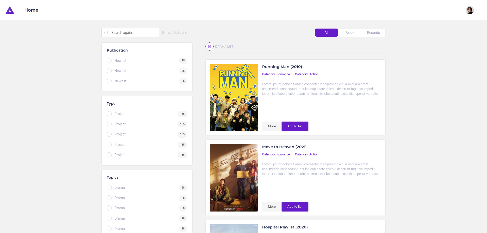

# Portfolio

Bienvenue sur mon portfolio ! Vous trouverez ci-dessous une liste de mes projets réalisés, avec une brève description, les technologies utilisées et des captures d'écran des projets.

## Projets

### 1. [Events app](https://github.com/ZAomineZ/eventsprojectlaravel)
- **Description** : Organise des événements avec calendrier intégré et notifications. Comprend un système d'administration pour la gestion des événements.
- **Technologies** : HTML5, CSS3, Laravel, Pusher, JavaScript, React

### 2. [Machinools App](https://github.com/ZAomineZ/seo_project)
- **Description** : Outil SEO centralisant plusieurs outils pour analyser le référencement d'un site web.
- **Technologies** : HTML5, CSS3, PHP, React, JavaScript

### 3. [CMSRails App](https://github.com/ZAomineZ/CMSRails)
- **Description** : Un CMS construit avec Ruby On Rails pour créer des articles avec des catégories relationnelles.
- **Technologies** : HTML5, CSS3, Svelte, Ruby, Rails, JavaScript

### 4. [Pics Anime Random App](https://github.com/ZAomineZ/waifu_album)
- **Description** : Application pour récupérer des gifs aléatoires sur des mangas, classés par catégorie.
- **Technologies** : HTML5, CSS3, VueJS, JavaScript

### 5. [Poe And Tik](https://gitlab.com/Bluup-Aomine/ecommerce_laravel)
- **Description** : Site e-commerce de vêtements vegan, développé avec Laravel et JavaScript vanilla pour un backend solide.
- **Technologies** : HTML5, CSS3, Laravel, JavaScript, Stripe

### 6. MyDramaList Like
- **Description** : Plateforme pour découvrir des dramas Coréens, Japonais et Chinois.
- **Technologies** : HTML5, CSS3, Laravel, JavaScript

### 7. [Quiz App](https://gitlab.com/Bluup-Aomine/quizz_app)
- **Description** : Créez et gérez des quiz sur diverses thématiques.
- **Technologies** : HTML5, CSS3, AdonisJS, Node, JavaScript, Vue3

### 8. [Pokemon Search App](https://gitlab.com/Bluup-Aomine/next_poke_api)
- **Description** : Application pour rechercher des Pokémon dans le Pokédex national via PokeAPI.
- **Technologies** : HTML5, CSS3, NextJS, React, JavaScript, Typescript

### 9. [Crawler Monitor App](https://www.youtube.com/watch?v=nm7cItMuZCo)
- **Description** : Outil SEO permettant d'analyser les facteurs SEO d'un site web.
- **Technologies** : HTML5, CSS3, React, PHP, JavaScript, Symfony, Python

### 10. [Portfolio](https://gitlab.com/Bluup-Aomine/portfolio)
- **Description** : Mon portfolio personnel présentant mes projets réalisés.
- **Technologies** : HTML5, CSS3, React, NextJS

